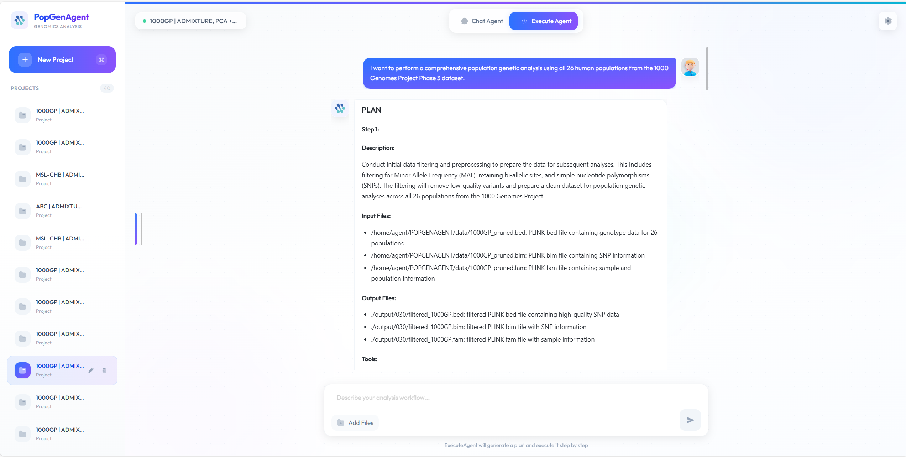
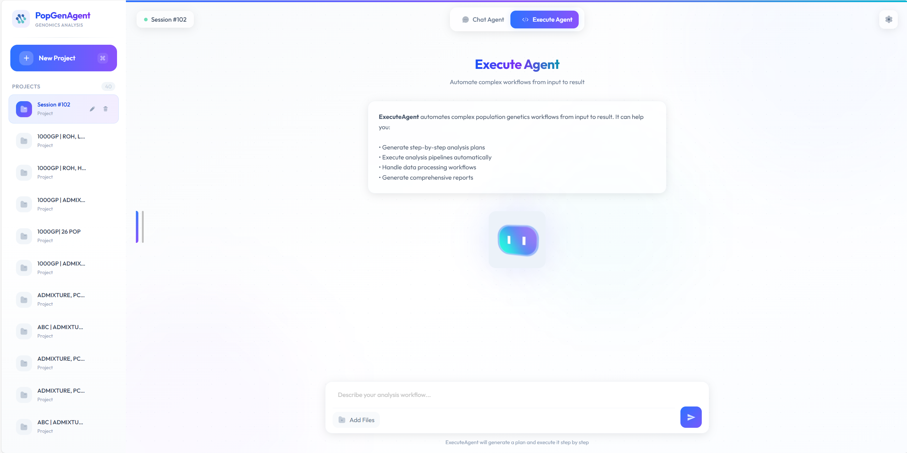
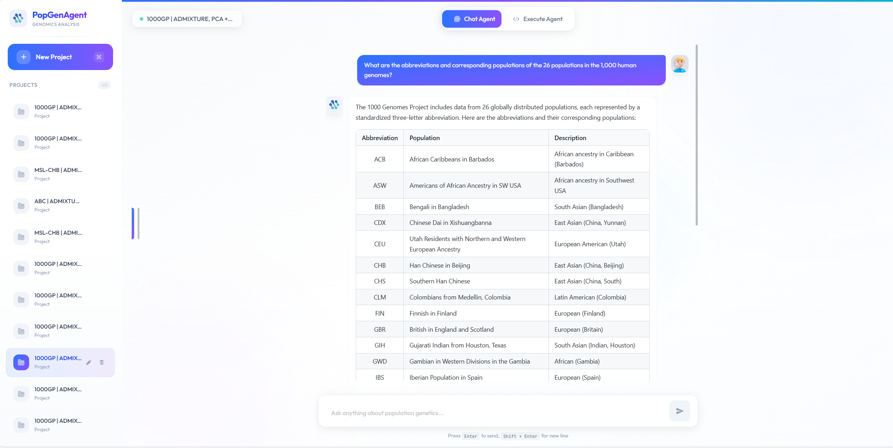
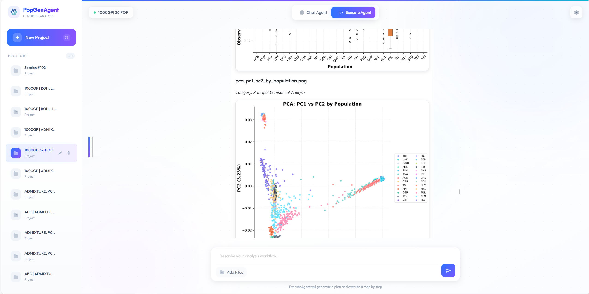

<p align="center">
  <h1 align="center">PopGenAgent</h1>
  <p align="center">
    <strong>Tool-Aware, Reproducible, Report-Oriented Workflows for Population Genomics</strong>
  </p>
  <p align="center">
    <a href="#installation">Install</a> •
    <a href="#quick-start">Quick Start</a> •
    <a href="#usage-modes">Usage</a> •
    <a href="#citation">Cite</a>
  </p>
</p>

---

## Overview

Population-genetic inference routinely requires coordinating many specialized tools, managing brittle file formats, iterating through diagnostics, and converting intermediate results into interpretable figures and written summaries.

**PopGenAgent** is a turnkey, report-oriented delivery system that packages a curated library of population-genetics toolchains into validated execution and visualization templates with standardized I/O contracts and full provenance capture.

| Design Principle | Description |
|------------------|-------------|
| **Retrieval-grounded assistance** | User interpretation and write-up grounded in literature and tool docs |
| **Template-driven execution** | Conservative, auditable commands with artefact integrity checks |
| **Report-ready output** | Publication-quality figures and full provenance tracking |
| **Cost-aware LLM use** | Economical models for template selection; high-capacity models for narrative reports |

### Screenshots

<p align="center">
  
  
</p>
<p align="center">
  
  
</p>

*Left: Plan generation and Execute Agent. Right: Chat Agent Q&A and analysis results.*

---

## Table of Contents

- [Screenshots](#screenshots)
- [Architecture](#architecture)
- [Supported Analyses](#supported-analyses)
- [Project Structure](#project-structure)
- [Prerequisites](#prerequisites)
- [Installation](#installation)
- [Configuration](#configuration)
- [Quick Start](#quick-start)
- [Usage Modes](#usage-modes)
- [Extending the Tool Library](#extending-the-tool-library)
- [Output Structure](#output-structure)
- [Citation](#citation)
- [License](#license)

---

## Architecture

PopGenAgent uses a multi-agent framework where each agent handles a distinct phase of the analysis lifecycle:

| Agent | Module | Role |
|:-----:|--------|------|
| **Plan** | `core/GenAgent.py` | Generates step-by-step execution plans from user goal and data manifest |
| **Task** | (integrated) | Instantiates shell scripts from templates for each planned step |
| **Debug** | (integrated) | Detects failures, diagnoses root causes, applies targeted repairs |
| **Analysis** | `core/AnaAgent.py` | Post-hoc analyses (e.g., fastsimcoal demographic modeling) |
| **Chat** | `core/ChatAgent.py` | Interactive Q&A grounded in PubMed and local knowledge |
| **Modeling** | `core/modelingagent.py` | Multi- and single-population demographic inference |

A **RAG (Retrieval-Augmented Generation)** layer backed by ChromaDB provides tool documentation retrieval, plan-level knowledge, and PubMed literature search.

---

## Supported Analyses

| Category | Tools & Methods |
|----------|-----------------|
| **Preprocessing** | VCF filtering, PLINK/VCF/BED conversion, LD pruning, relatedness removal |
| **Population Structure** | PCA (smartpca / PLINK), ADMIXTURE (K selection + CV), TreeMix (migration + bootstrap) |
| **Allele-Sharing** | *f*-statistics, D-statistics, qpAdm/qpGraph (ADMIXTOOLS) |
| **Genetic Diversity** | Heterozygosity, π, Tajima's D, ROH |
| **LD Decay** | Per-population LD decay (PLINK / PopLDdecay) |
| **Selection** | iHS, XP-EHH (selscan) |
| **Demographics** | fastsimcoal2 (single- and multi-population) |
| **Visualization** | Publication-quality figures for all analyses |

> **14** primary tools in `tools/` · **80+** detailed docs in `knowledge/tool/`

---

## Project Structure

```
POPAGENT/
├── config.yaml.example       # Config template → copy to config.yaml
├── config_loader.py          # Centralized YAML config reader
├── run.py                    # CLI entry point
├── manage.py                 # Django (Web UI)
├── requirements.txt
├── environment.yml
│
├── core/                     # Agent logic
│   ├── GenAgent.py           # Plan + Task orchestrator
│   ├── AnaAgent.py           # Post-hoc analysis
│   ├── ChatAgent.py          # Interactive Q&A
│   ├── modelingagent.py     # Demographic modeling workflow
│   ├── task_manager.py      # Concurrent task scheduling
│   └── modeling/            # Sub-agents (obs, pca, admixture, treemix, …)
│
├── backend/                  # Django app (views, api_pool, utils)
├── server/                   # Django project config
├── web/                      # Vue.js frontend (Vite + TypeScript)
├── knowledge/                # RAG knowledge (Plan, Task, PubMed, tool/)
├── tools/                    # Tool link registry
├── scripts/                  # easySFS, plink2treemix, R plotting, etc.
├── img/                      # Screenshots and figures for README
├── data/                     # Input data (user-provided)
└── output/                   # Per-session outputs
```

---

## Prerequisites

| Requirement | Notes |
|-------------|-------|
| **Python** | 3.9+ (tested with 3.11) |
| **Conda** | Recommended for environment management |
| **Node.js** | 18+ (only for Web UI) |
| **Bioinformatics** | PLINK/PLINK2, VCFtools, BCFtools, ADMIXTURE, TreeMix, ADMIXTOOLS, fastsimcoal2, smartpca, selscan, PopLDdecay, R (ggplot2, optparse) |
| **LLM API** | OpenAI-compatible endpoint |

---

## Installation

### 1. Clone

```bash
git clone https://github.com/your-username/PopGenAgent.git
cd PopGenAgent
```

### 2. Environment

**Option A** (recommended):

```bash
conda env create -f environment.yml
conda activate agent9
```

**Option B**:

```bash
conda create -n popgenagent python=3.11
conda activate popgenagent
pip install -r requirements.txt
```

### 3. Web UI (optional)

```bash
cd web
npm install
npm run build
cd ..
```

---

## Configuration

All settings are managed via `config.yaml`.

**1. Create config**

```bash
cp config.yaml.example config.yaml
```

**2. Edit `config.yaml`**

```yaml
llm:
  api_key: "sk-your-key-here"
  base_url: "https://api.openai.com/v1"
  default_model: "gpt-4"
  executor: true

api_pool:
  - api_key: "sk-pool-key-1"
    base_url: "https://api.openai.com/v1"
    name: "pool_1"
    max_concurrent: 3

pubmed:
  api_key: "your-ncbi-api-key"
  email: "your@email.com"
```

> ⚠️ **Security**: `config.yaml` is git-ignored. Never commit API keys.

**3. Input data**

Place files in `./data/`, e.g.:

```
data/
├── 1000GP_pruned.bed
├── 1000GP_pruned.bim
└── 1000GP_pruned.fam
```

---

## Quick Start

### CLI

Edit `run.py` with your goal and data manifest, then:

```bash
conda activate agent9
python run.py
```

The agent will: (1) generate a plan, (2) execute steps sequentially, (3) debug and retry on failure, (4) save outputs to `./output/<session_id>/`.

### Python API

```python
from core.GenAgent import GenAgent
from config_loader import get_llm_config

cfg = get_llm_config()
manager = GenAgent(
    api_key=cfg["api_key"],
    base_url=cfg["base_url"],
    excutor=True,
    tools_dir="tools",
    id="001"
)

datalist = [
    "./data/1000GP_pruned.bed: SNP file in bed format",
    "./data/1000GP_pruned.bim: snp info",
    "./data/1000GP_pruned.fam: population and sample ID",
]
goal = "Complete population genetic analysis: PCA, ADMIXTURE, FST, LD decay, ROH"

manager.execute_PLAN(goal, datalist)
results = manager.execute_TASK(datalist)
```

---

## Usage Modes

### 1. CLI Mode

For batch or scripted analyses:

```bash
python run.py
```

### 2. Web UI Mode (Django backend)

Start the Django server to use the interactive browser interface:

```bash
python manage.py runserver 0.0.0.0:8000
```

Then open **http://localhost:8000** in your browser.

**Web UI features**:
- Create and manage multiple analysis sessions
- Review and modify execution plans before running
- Real-time execution monitoring with step-by-step output
- Interactive Q&A with the Chat Agent (literature-grounded)
- Post-hoc Analysis Agent for demographic modeling
- File management with drag-and-drop upload
- Settings panel for API key configuration

> **Note**: Build the frontend first (`cd web && npm install && npm run build`) if you haven't already.

### 3. Frontend Dev Server (Vue.js)

For Vue.js development with hot reload:

```bash
cd web
npm install   # Required first: installs vite and dependencies
npm run dev
```

> If you see `vite: not found`, run `npm install` in `web/` first.

---

## Extending the Tool Library

**1. Tool link** in `./tools/MyNewTool.txt`:

```
https://github.com/author/MyNewTool
https://mytool-docs.readthedocs.io/
```

**2. Documentation** in `./knowledge/tool/mynewtool.txt`:

```
MyNewTool - Population Genetics Analysis
Usage: mynewtool --input <vcf> --output <result> [options]
...
```

**3. Knowledge base**

- Plan examples → `knowledge/Plan_Knowledge.json`
- Task examples → `knowledge/Task_Konwledge.json`
- Demographic models → `knowledge/fastsimcoal/` (`.tpl`, `.est`)

RAG indexes new docs on next startup.

---

## Output Structure

```
output/<session_id>/
├── <id>_PLAN.json            # Execution plan
├── <id>_Step_1.sh ... _N.sh  # Generated scripts
├── <id>_DEBUG_*.json         # Debug inputs/outputs
├── *.png, *.pdf              # Figures
├── *.txt, *.log              # Results
└── ana/
    ├── data/                 # SFS, converted data
    └── modeling/             # fastsimcoal2 results
```

Full **reproducibility** and **provenance** for all commands and outputs.

---

## Citation

```bibtex
@article{popgenagent2025,
  title   = {PopGenAgent: Tool-Aware, Reproducible, Report-Oriented
             Workflows for Population Genomics},
  author  = {...},
  journal = {...},
  year    = {2025}
}
```

---

## License

Academic and research use. See [LICENSE](LICENSE) for details.
